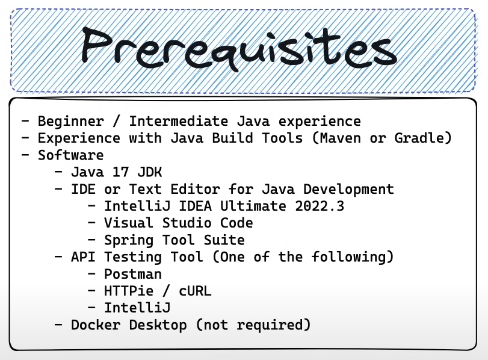
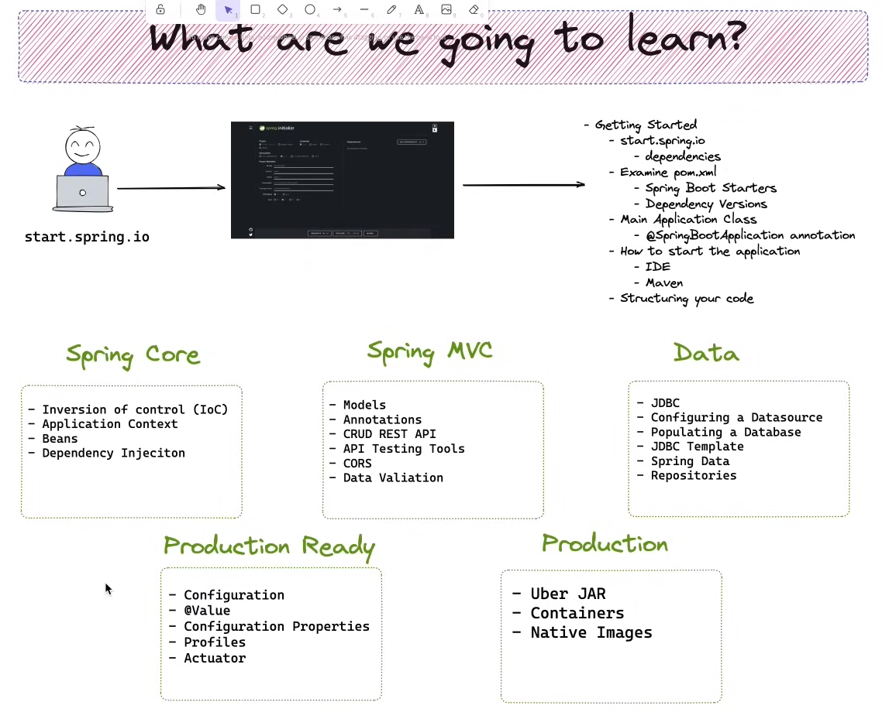

# Spring Boot Reference







Spring Framework is 
- an open-source application framework and 
- inversion of control container _for the Java platform._

Key features of Spring Framework include:

1. **Dependency Injection**: This is a design pattern that removes the dependency from the programming code. It makes the code easier to test and maintain.


2. **Aspect-Oriented Programming (AOP)**: This is a programming paradigm that aims to increase modularity by allowing the separation of cross-cutting concerns.


3. **Spring MVC**: This is a model-view-controller framework for building web applications.


4. **Spring Boot**: This is a project built on top of the Spring Framework. It provides an easier and faster way to set up, configure, and run both simple and web-based applications.


5. **Integration with other frameworks**: Spring Framework can be easily integrated with other popular frameworks like Hibernate, JPA, Struts, etc.


6. **Transaction Management**: Spring provides a consistent transaction management interface that can scale down to a local transaction (using a single database, for example) and scale up to global transactions (using JTA, for example).

Inversion of Control (IoC)
--------------------------
Inversion of Control (IoC) is 
- a design principle in software engineering 
- which inverts the flow of control as compared to traditional control flow. 

In traditional programming, 
- the custom code that expresses the purpose of the program 
  - calls into reusable libraries to take care of generic tasks, 
- but with _inversion of control_, 
  - it is the framework that calls into the custom, or task-specific, code.

In the context of the Spring Framework, IoC is implemented through Dependency Injection (DI). This means that objects are given their dependencies at creation time by some external entity that coordinates each object in the system. That is, dependencies are pushed into objects from outside.

This approach has several benefits:

1. **Decoupling**: The objects do not need to look up their dependencies, or even know where they are located. They are simply presented to them when they are instantiated. This leads to a high degree of decoupling.

2. **Easier to test**: Because dependencies are injected into objects, it's easy to inject mock dependencies for testing.

3. **More readable code**: Code is often more readable and easier to understand since there's no need for complicated setup procedures.

Here's a simple example of how IoC works in Spring:

```java
public class TextEditor {
    private SpellChecker spellChecker;

    // a spellChecker is injected via this constructor
    public TextEditor(SpellChecker spellChecker) {
        this.spellChecker = spellChecker;
    }

    public void spellCheck() {
        spellChecker.checkSpelling();
    }
}
```

In this example, `TextEditor` doesn't create a `SpellChecker` using a `new` keyword. Instead, it's being injected into `TextEditor` via the constructor, an example of Constructor-based Dependency Injection. This is the essence of Inversion of Control.


Spring Core
----
Spring Core is the fundamental part of the Spring Framework which 
- provides the Dependency Injection features. 

The core package uses the technique of Inversion of Control (IoC) that enables a Java application to use its components with dependencies. 

Essentially, the Spring Core is responsible for 
- creating the objects, 
- managing them (creating and deleting), 
- wiring them together, 
- configuring them, and 
- managing their complete lifecycle.

The Spring Core consists of the `BeanFactory`, 
- which is a sophisticated implementation of the factory pattern. 

_It removes the need for programmatic singletons and allows you to decouple the configuration and specification of dependencies from your actual program logic._

Here's a simple example of how Spring Core works:

```java
import org.springframework.context.ApplicationContext;
import org.springframework.context.support.ClassPathXmlApplicationContext;

public class MainApp {
   public static void main(String[] args) {
      ApplicationContext context = new ClassPathXmlApplicationContext("Beans.xml");
      HelloWorld obj = (HelloWorld) context.getBean("helloWorld");
      obj.getMessage();
   }
}
```

In this example, `Beans.xml` is the configuration file which contains the information of classes and how to wire them, and `HelloWorld` is a simple bean class. The `ApplicationContext` is a Spring container which instantiates, configures and assembles the beans by reading the configuration metadata from the XML file.

Application Context
---

`ApplicationContext` is a central interface within Spring Framework. It provides configuration for an application. This is read-only while the application is running, but may be reloaded if the implementation supports it. It inherits from `BeanFactory` interface and adds more enterprise-specific functionality on top of it.

In the context of Spring, a `Bean` is a normal Java object that is instantiated, assembled, and managed by a Spring IoC container. These beans are created with the configuration metadata that is supplied to the container, typically in the form of XML configuration files.

`ApplicationContext` is responsible for instantiating, configuring, and assembling these beans. The container gets its instructions on what objects to instantiate, configure, and assemble by reading configuration metadata provided. This metadata can be provided in XML, Java annotations, or Java code.

Here's a simple example of how `ApplicationContext` and `Bean` work together:

```java
import org.springframework.context.ApplicationContext;
import org.springframework.context.support.ClassPathXmlApplicationContext;

public class MainApp {
   public static void main(String[] args) {
      ApplicationContext context = new ClassPathXmlApplicationContext("Beans.xml");
      HelloWorld obj = (HelloWorld) context.getBean("helloWorld");
      obj.getMessage();
   }
}
```

In this example, `Beans.xml` is the configuration file which contains the information of classes and how to wire them, and `HelloWorld` is a simple bean class. The `ApplicationContext` is a Spring container which instantiates, configures and assembles the beans by reading the configuration metadata from the XML file.